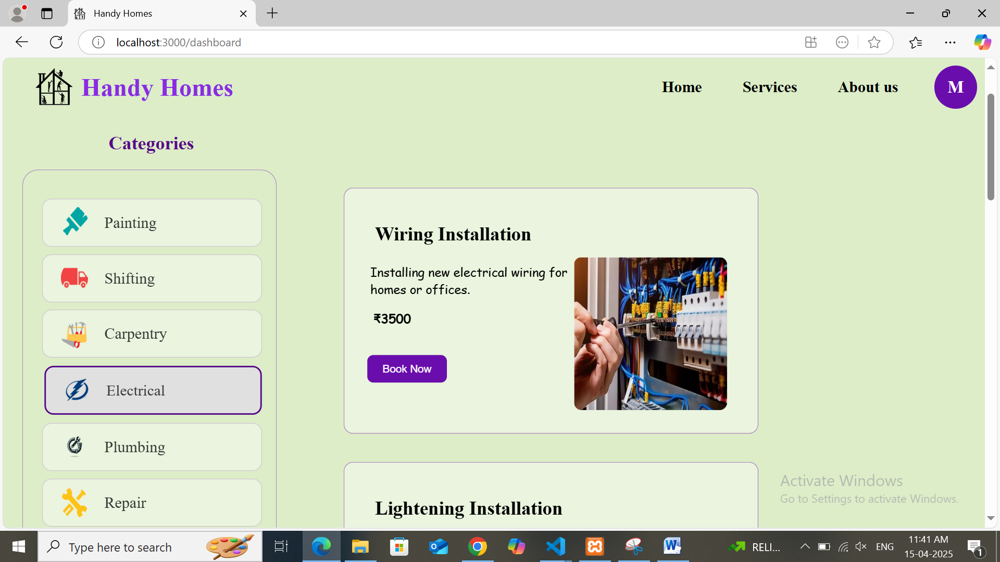
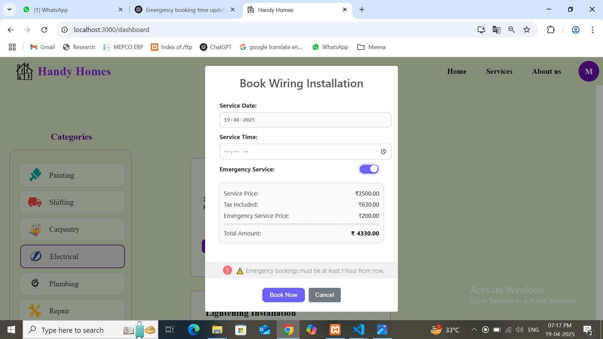
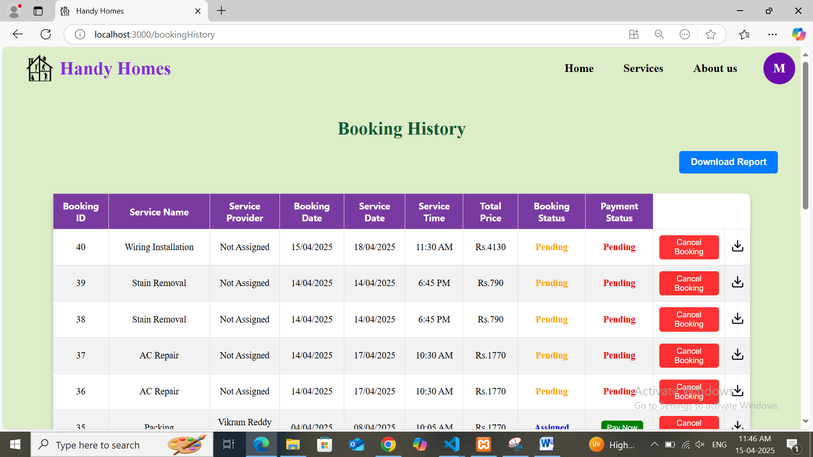
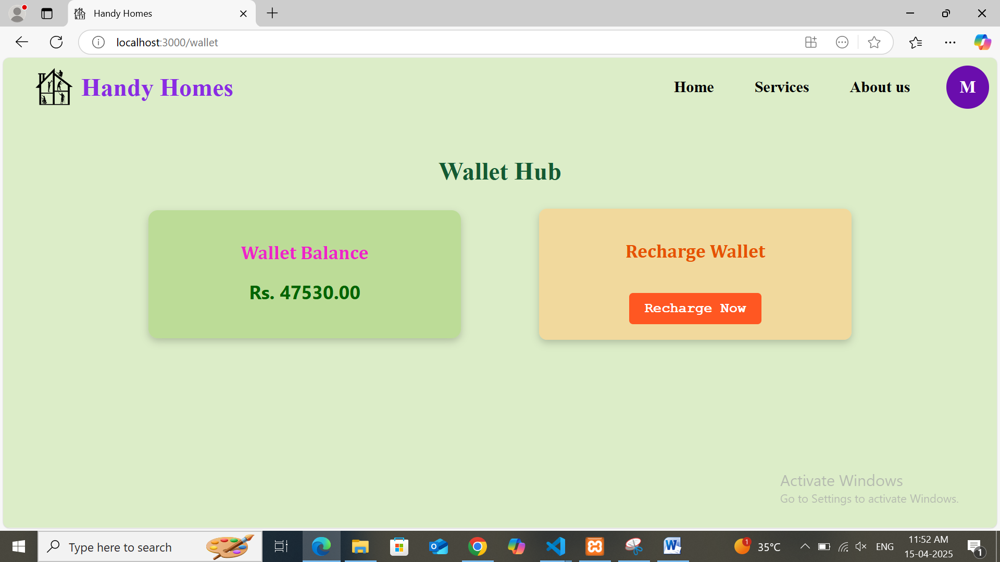
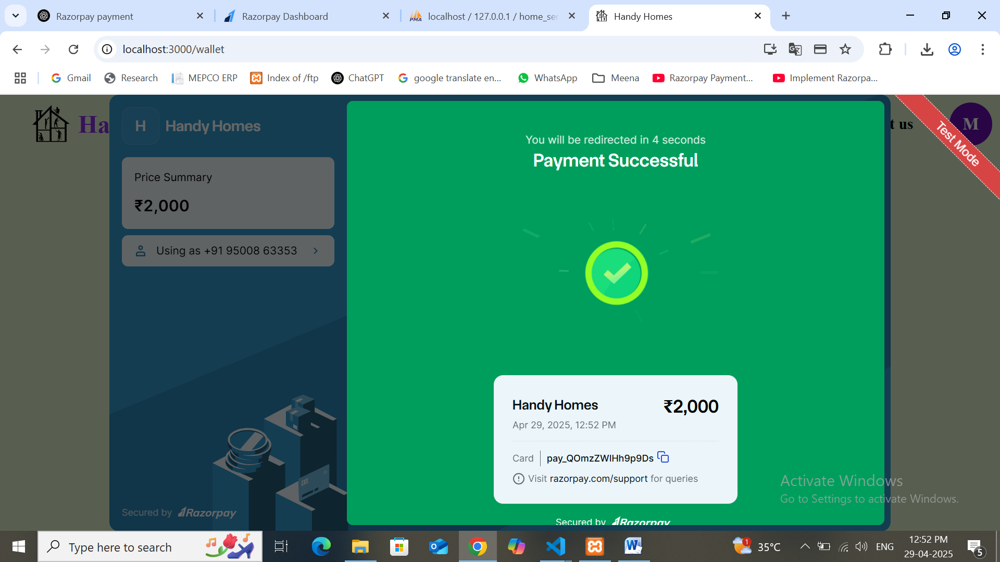
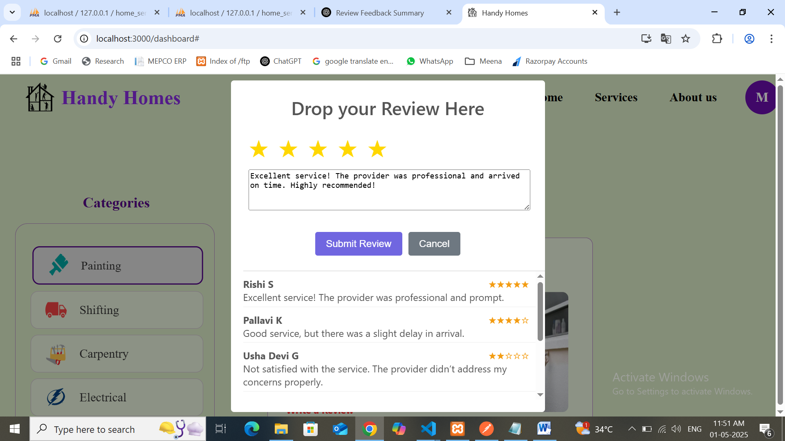

# Home Service Provider System - Customer Portal

Home Services Provider System – Customer Portal is a web-based application that enables customers to easily book and manage home services such as plumbing, electrical repairs, and cleaning. It uses a secure wallet-based payment system with Razorpay integration, supports SMS-based bookings via Twilio, prioritizes emergency requests, and automates provider assignment, notifications, payments, and feedback. The system is built using React.js, Node.js, Express, and MySQL, offering a secure, fast, and user-friendly solution for managing home services.

## Technologies Used
- Frontend: React.js
- Backend: Node.js, Express.js
- Database: MySQL

## Features
- Online and SMS-based booking for home services like plumbing, electrical work, and cleaning
- Emergency service support with priority scheduling and time validation
- Wallet-based payment system with Razorpay recharge (post provider assignment)
- Automatic service provider assignment based on location and availability
- Real-time email and SMS notifications with booking tracking
- Feedback and rating system to ensure service quality
- Clean, intuitive, and user-friendly interface

## Modules Used

- **User Login Module** – Secure login using email and password with JWT-based authentication.
- **Service Browsing Module** – Browse available home services with detailed descriptions and pricing.
- **Service Booking Module** – Book services by selecting date, time, and emergency priority with wallet validation.
- **Booking History Module** – View past bookings with service, provider, and payment details.
- **Notifications Module** – Real-time email notifications for bookings and feedback using Nodemailer.
- **User Profile Module** – View and update personal details (email cannot be changed for security).
- **Payment Module** – Wallet-based payments with Razorpay integration for secure recharges.
- **Feedback Module** – Rate and review services to improve service quality.
- **Offline Service Booking Module** – SMS-based service booking using Twilio without internet access.

# Sample Screenshots

<table>
  <tr>
    <td></td>
    <td></td>
  </tr>
  <tr>
    <td></td>
    <td></td>
  </tr>
  <tr>
    <td></td>
    <td></td>
  </tr>
</table>
